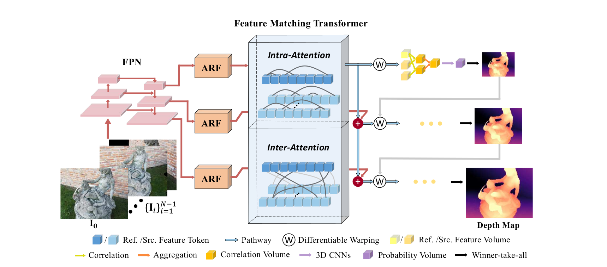

# (CVPR2022) TransMVSNet: Global Context-aware Multi-view Stereo Network with Transformers


## [Paper](https://openaccess.thecvf.com/content/CVPR2022/papers/Ding_TransMVSNet_Global_Context-Aware_Multi-View_Stereo_Network_With_Transformers_CVPR_2022_paper.pdf) | [Project Page](https://dingyikang.github.io/transmvsnet.github.io/) | [Arxiv](https://arxiv.org/abs/2111.14600/) | [Models](https://drive.google.com/drive/folders/1ZJ9bx9qZENEoXv5i5izKCNszlaCNBMkJ?usp=sharing/)

**Tips**: If you meet any problems when reproduce our results, please contact Yikang Ding (dyk20@mails.tsinghua.edu.cn). We are happy to help you solve the problems and share our experience.


## ⚠ Change log
* 09.2022: Add more detailed instruction of how to reproduce the reported results (see [testing-on-dtu](#-testing-on-dtu)).
* 09.2022: Fix the bugs in MATLAB evaluation code (remove the debug code).
* 09.2022: Fix the bug of default fuse parameters of gipuma, which could have a great impact on the final results.
* 09.2022: Update the website link and instruction of installing gipuma, which would affect the fusion quality.


## 📔 Introduction
In this paper, we present TransMVSNet, based on our exploration of feature matching in multi-view stereo (MVS). We analogize MVS back to its nature of a feature matching task and therefore propose a powerful Feature Matching Transformer (FMT) to leverage intra- (self-) and inter- (cross-) attention to aggregate long-range context information within and across images. To facilitate a better adaptation of the FMT, we leverage an Adaptive Receptive Field (ARF) module to ensure a smooth transit in scopes of features and bridge different stages with a feature pathway to pass transformed features and gradients across different scales. In addition, we apply pair-wise feature correlation to measure similarity between features, and adopt ambiguity-reducing focal loss to strengthen the supervision. To the best of our knowledge, TransMVSNet is the first attempt to leverage Transformer into the task of MVS. As a result, our method achieves state-of-the-art performance on DTU dataset, Tanks and Temples benchmark, and BlendedMVS dataset.



## 🔧 Installation
Our code is tested with Python==3.6/3.7/3.8, PyTorch==1.6.0/1.7.0/1.9.0,  CUDA==10.2 on Ubuntu-18.04 with NVIDIA GeForce RTX 2080Ti. Similar or higher version should work well.

To use TransMVSNet, clone this repo:
```
git clone https://github.com/MegviiRobot/TransMVSNet.git
cd TransMVSNet
```

We highly recommend using [Anaconda](https://www.anaconda.com/) to manage the python environment:
```
conda create -n transmvsnet python=3.6
conda activate transmvsnet
pip install -r requirements.txt
```
<!--
Install pytorch-fast-transformers by:
```
pip install --user pytorch-fast-transformers
```
-->
We also recommend using apex, you can install apex from the [official repo](https://www.github.com/nvidia/apex).


## 📦 Data preparation
In TransMVSNet, we mainly use [DTU](https://roboimagedata.compute.dtu.dk/), [BlendedMVS](https://github.com/YoYo000/BlendedMVS/) and [Tanks and Temples](https://www.tanksandtemples.org/) to train and evaluate our models. You can prepare the corresponding data by following the instructions below.

### ✔  DTU
For DTU training set, you can download the preprocessed [DTU training data](https://drive.google.com/file/d/1eDjh-_bxKKnEuz5h-HXS7EDJn59clx6V/view)
 and [Depths_raw](https://virutalbuy-public.oss-cn-hangzhou.aliyuncs.com/share/cascade-stereo/CasMVSNet/dtu_data/dtu_train_hr/Depths_raw.zip)
 (both from [Original MVSNet](https://github.com/YoYo000/MVSNet)), and unzip them to construct a dataset folder like:
```
dtu_training
 ├── Cameras
 ├── Depths
 ├── Depths_raw
 └── Rectified
```
For DTU testing set, you can download the preprocessed [DTU testing data](https://drive.google.com/open?id=135oKPefcPTsdtLRzoDAQtPpHuoIrpRI_) (from [Original MVSNet](https://github.com/YoYo000/MVSNet)) and unzip it as the test data folder, which should contain one ``cams`` folder, one ``images`` folder and one ``pair.txt`` file.

### ✔  BlendedMVS
We use the [low-res set](https://1drv.ms/u/s!Ag8Dbz2Aqc81gVDgxb8MDGgoV74S?e=hJKlvV) of BlendedMVS dataset for both training and testing. You can download the [low-res set](https://1drv.ms/u/s!Ag8Dbz2Aqc81gVDgxb8MDGgoV74S?e=hJKlvV) from [orignal BlendedMVS](https://github.com/YoYo000/BlendedMVS) and unzip it to form the dataset folder like below:

```
BlendedMVS
 ├── 5a0271884e62597cdee0d0eb
 │     ├── blended_images
 │     ├── cams
 │     └── rendered_depth_maps
 ├── 59338e76772c3e6384afbb15
 ├── 59f363a8b45be22330016cad
 ├── ...
 ├── all_list.txt
 ├── training_list.txt
 └── validation_list.txt
```

### ✔  Tanks and Temples
Download our preprocessed [Tanks and Temples dataset](https://drive.google.com/file/d/1IHG5GCJK1pDVhDtTHFS3sY-ePaK75Qzg/view?usp=sharing) and unzip it to form the dataset folder like below:
```
tankandtemples
 ├── advanced
 │  ├── Auditorium
 │  ├── Ballroom
 │  ├── ...
 │  └── Temple
 └── intermediate
        ├── Family
        ├── Francis
        ├── ...
        └── Train
```

## 📈 Training

### ✔ Training on DTU
Set the configuration in ``scripts/train.sh``:
* Set ``MVS_TRAINING`` as the path of DTU training set.
* Set ``LOG_DIR`` to save the checkpoints.
* Change ``NGPUS`` to suit your device.
* We use ``torch.distributed.launch`` by default.

To train your  own model, just run:
```
bash scripts/train.sh
```
You can conveniently modify more hyper-parameters in ``scripts/train.sh`` according to the argparser in ``train.py``, such as ``summary_freq``, ``save_freq``, and so on.

### ✔ Finetune on BlendedMVS
For a fair comparison with other SOTA methods on Tanks and Temples benchmark, we finetune our model on BlendedMVS dataset after training on DTU dataset.

Set the configuration in ``scripts/train_bld_fintune.sh``:
* Set ``MVS_TRAINING`` as the path of BlendedMVS dataset.
* Set ``LOG_DIR`` to save the checkpoints and training log.
* Set ``CKPT`` as path of the loaded ``.ckpt`` which is trained on DTU dataset.

To finetune your own model, just run:
```
bash scripts/train_bld_fintune.sh
```

## 📊 Testing
For easy testing, you can download our [pre-trained models](https://drive.google.com/drive/folders/1ZJ9bx9qZENEoXv5i5izKCNszlaCNBMkJ?usp=sharing) and put them in `checkpoints` folder, or use your own models and follow the instruction below.

### ✔ Testing on DTU

**Important Tips:** to reproduce our reported results, you need to:
* compile and install the modified `gipuma` from [Yao Yao](https://github.com/YoYo000/fusibile) as introduced below
* use the latest code as we have fixed tiny bugs and updated the fusion parameters
* make sure you install the right version of python and pytorch, use some old versions would throw warnings of the default action of `align_corner` in several functions, which would affect the final results
* be aware that we only test the code on 2080Ti and Ubuntu 18.04, other devices and systems might get slightly different results
* make sure that you use the `model_dtu.ckpt` for testing


To start testing, set the configuration in ``scripts/test_dtu.sh``:
* Set ``TESTPATH`` as the path of DTU testing set.
* Set ``TESTLIST`` as the path of test list (.txt file).
* Set ``CKPT_FILE`` as the path of the model weights.
* Set ``OUTDIR`` as the path to save results.

Run:
```
bash scripts/test_dtu.sh
```
**Note:** You can use the `gipuma` fusion method or `normal` fusion method to fuse the point clouds. **In our experiments, we use the `gipuma` fusion method by default**. 
With using the uploaded ckpt and latest code, these two fusion methods would get the below results:
|   Fuse    | Overall |
| --- | --- |
|   gipuma   | 0.304 |
|   normal    | 0.314 |

<!-- The simple instruction for installing and compiling `gipuma` can be found [here](https://github.com/YoYo000/MVSNet#post-processing).  The installed gipuma is a modified version from [Yao Yao](https://github.com/YoYo000/fusibile).-->
To install the `gipuma`, clone the modified version from [Yao Yao](https://github.com/YoYo000/fusibile).
Modify the line-10 in `CMakeLists.txt` to suit your GPUs. Othervise you would meet warnings when compile it, which would lead to failure and get 0 points in fused point cloud. For example, if you use 2080Ti GPU, modify the line-10 to:
```
set(CUDA_NVCC_FLAGS ${CUDA_NVCC_FLAGS};-O3 --use_fast_math --ptxas-options=-v -std=c++11 --compiler-options -Wall -gencode arch=compute_70,code=sm_70)
```
If you use other kind of GPUs, please modify the arch code to suit your device (`arch=compute_XX,code=sm_XX`).
Then install it by `cmake .` and `make`, which will generate the executable file at `FUSIBILE_EXE_PATH`.
Please note 


For quantitative evaluation on DTU dataset, download [SampleSet](http://roboimagedata.compute.dtu.dk/?page_id=36) and [Points](http://roboimagedata.compute.dtu.dk/?page_id=36). Unzip them and place `Points` folder in `SampleSet/MVS Data/`. The structure looks like:
```
SampleSet
├──MVS Data
      └──Points
```
In ``DTU-MATLAB/BaseEvalMain_web.m``, set `dataPath` as path to `SampleSet/MVS Data/`, `plyPath` as directory that stores the reconstructed point clouds and `resultsPath` as directory to store the evaluation results. Then run ``DTU-MATLAB/BaseEvalMain_web.m`` in matlab.

We also upload our final point cloud results to [here](https://drive.google.com/drive/folders/1a3b0tDoPj9y7GMhOSjb5TBRq7ahYjp4f?usp=sharing). You can easily download them and evaluate them using the `MATLAB` scripts, the results look like:


| Acc. (mm) | Comp. (mm) | Overall (mm) |
|-----------|------------|--------------|
| 0.321     | 0.289      | 0.305        |


### ✔ Testing on Tanks and Temples
We recommend using the finetuned models (``model_bld.ckpt``) to test on Tanks and Temples benchmark.

Similarly, set the configuration in ``scripts/test_tnt.sh``:
* Set ``TESTPATH`` as the path of intermediate set or advanced set.
* Set ``TESTLIST`` as the path of test list (.txt file).
* Set ``CKPT_FILE`` as the path of the model weights.
* Set ``OUTDIR`` as the path to save resutls.

To generate point cloud results, just run:
```
bash scripts/test_tnt.sh
```
Note that：
* The parameters of point cloud fusion have not been studied thoroughly and the performance can be better if cherry-picking more appropriate thresholds for each of the scenes.
* The dynamic fusion code is borrowed from [AA-RMVSNet](https://github.com/QT-Zhu/AA-RMVSNet).

For quantitative evaluation, you can upload your point clouds to [Tanks and Temples benchmark](https://www.tanksandtemples.org/).

## 🔗 Citation

```bibtex
@inproceedings{ding2022transmvsnet,
  title={Transmvsnet: Global context-aware multi-view stereo network with transformers},
  author={Ding, Yikang and Yuan, Wentao and Zhu, Qingtian and Zhang, Haotian and Liu, Xiangyue and Wang, Yuanjiang and Liu, Xiao},
  booktitle={Proceedings of the IEEE/CVF Conference on Computer Vision and Pattern Recognition},
  pages={8585--8594},
  year={2022}
}
```

## 📌 Acknowledgments
We borrow some code from [CasMVSNet](https://github.com/alibaba/cascade-stereo/tree/master/CasMVSNet), [LoFTR](https://github.com/zju3dv/LoFTR) and [AA-RMVSNet](https://github.com/QT-Zhu/AA-RMVSNet). We thank the authors for releasing the source code.
